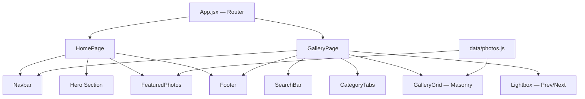

# 🖼️ Rohit's Gallery — Premium Upgrade Plan

Transform your basic Picsum API gallery into a stunning, personal photo gallery with a premium dark glassmorphism design, hero landing, category filtering, lightbox navigation, search, and smooth animations.

## Current State

Your project is a **React 19 + Vite 8 + Tailwind CSS 4** app that:
- Fetches random images from `picsum.photos` API
- Displays them in a 3-column grid with pagination
- Has a basic image modal with photo details
- Uses a dark theme with orange accent colors

## Proposed Architecture



---

## Proposed Changes

### 1. Data Layer — `src/data/photos.js`

#### [NEW] [photos.js](file:///d:/FroentEnd/Ract/17-Gallery-project/src/data/photos.js)

A local data file replacing the Picsum API. Each photo entry will have:

```js
{
  id: 1,
  title: "Mountain Sunrise",
  category: "nature",    // personal | travel | nature | city | art
  description: "Golden light over the Himalayas",
  date: "2025-03-15",
  location: "Manali, India",
  featured: true,        // shown on the Hero section
  src: "/photos/nature-1.jpg"  // from public/photos/
}
```

~20 placeholder entries across all 5 categories. This removes the **axios** dependency and API fetch logic entirely — your gallery works offline.

---

### 2. Photo Assets — `public/photos/`

#### [NEW] `public/photos/` directory

I'll generate **20 beautiful placeholder images** using the image generation tool, organized by category:

| Category | Files | Subjects |
|----------|-------|----------|
| 📷 Personal | `personal-1.jpg` to `personal-4.jpg` | Portraits, lifestyle |
| 🏞️ Travel | `travel-1.jpg` to `travel-4.jpg` | Landscapes, destinations |
| 🌄 Nature | `nature-1.jpg` to `nature-4.jpg` | Mountains, sunsets, wildlife |
| 🏙️ City | `city-1.jpg` to `city-4.jpg` | Urban, architecture, streets |
| 🎨 Art | `art-1.jpg` to `art-4.jpg` | Creative, abstract, colors |

Using `public/` folder (not `src/assets/`) so they're served as static files and easy to swap with your real photos later.

---

### 3. Design System — Styles

#### [MODIFY] [index.css](file:///d:/FroentEnd/Ract/17-Gallery-project/src/index.css)

Replace the single `@import "tailwindcss"` with a full design system:
- Google Fonts (Inter + Outfit)
- CSS custom properties for the glassmorphism palette
- Custom animations: `fadeIn`, `slideUp`, `scaleIn`, `float`, `shimmer`
- Glassmorphism utility classes: `.glass-card`, `.glass-dark`, `.glass-border`
- Scrollbar styling
- Smooth transitions base layer

#### [DELETE] [App.css](file:///d:/FroentEnd/Ract/17-Gallery-project/src/App.css)

Remove the default Vite boilerplate CSS (logo spin, `.card`, `.read-the-docs` — all unused).

---

### 4. Layout Components

#### [NEW] [Navbar.jsx](file:///d:/FroentEnd/Ract/17-Gallery-project/src/components/Navbar.jsx)

- Sticky top navigation with glassmorphism background
- Logo/brand: "Rohit's Gallery" with camera emoji
- Nav links: Home, Gallery
- Active link highlight with orange accent
- Mobile hamburger menu

#### [NEW] [Hero.jsx](file:///d:/FroentEnd/Ract/17-Gallery-project/src/components/Hero.jsx)

- Full-viewport hero section with animated gradient background
- Your name/title: "Rohit's Gallery"
- Subtitle: "Capturing moments, one frame at a time"
- Animated floating decorative elements
- Stats counter (Total Photos, Categories, Featured)
- "Explore Gallery" CTA button → scrolls to gallery section
- 3 featured photo previews with glassmorphism cards

#### [NEW] [Footer.jsx](file:///d:/FroentEnd/Ract/17-Gallery-project/src/components/Footer.jsx)

- Dark glassmorphism footer
- Brand name + tagline
- Quick nav links
- Social links (placeholder)
- Copyright

---

### 5. Gallery Components

#### [NEW] [SearchBar.jsx](file:///d:/FroentEnd/Ract/17-Gallery-project/src/components/SearchBar.jsx)

- Search input with glass effect
- Search icon
- Live filtering by photo title, description, location
- "X results found" counter
- Clear search button

#### [NEW] [CategoryTabs.jsx](file:///d:/FroentEnd/Ract/17-Gallery-project/src/components/CategoryTabs.jsx)

- Horizontal scrollable tabs: All, 📷 Personal, 🏞️ Travel, 🌄 Nature, 🏙️ City, 🎨 Art
- Active tab with orange gradient background
- Smooth slide animations on tab switch
- Photo count badge on each tab

#### [MODIFY] [GalleryGrid.jsx](file:///d:/FroentEnd/Ract/17-Gallery-project/src/components/GalleryGrid.jsx)

- Replace Picsum API data shape with local photo data shape
- Add staggered fade-in animation on load
- Hover effects: scale + overlay with photo title + category badge
- Glass card styling
- "No photos found" empty state for search/filter
- Remove `item.download_url` / `item.author` → use `photo.src` / `photo.title`

#### [NEW] [Lightbox.jsx](file:///d:/FroentEnd/Ract/17-Gallery-project/src/components/Lightbox.jsx)

Replaces `ImageModal.jsx`. A proper full-screen lightbox with:
- Full-screen backdrop with blur
- Large centered image
- **Previous / Next** buttons (arrow keys support)
- Photo info panel: title, category, date, location, description
- Close button + ESC key support
- Swipe-like transition animations
- Photo counter: "3 of 20"

#### [DELETE] [ImageModal.jsx](file:///d:/FroentEnd/Ract/17-Gallery-project/src/components/ImageModal.jsx)

Replaced by the new Lightbox component.

#### [DELETE] [PaginationFooter.jsx](file:///d:/FroentEnd/Ract/17-Gallery-project/src/components/PaginationFooter.jsx)

No longer needed — all photos are local, no pagination required. Category tabs + search handle filtering.

#### [DELETE] [LoadingOverlay.jsx](file:///d:/FroentEnd/Ract/17-Gallery-project/src/components/LoadingOverlay.jsx)

No API loading needed anymore — photos are local/instant.

#### [KEEP] [ErrorMessage.jsx](file:///d:/FroentEnd/Ract/17-Gallery-project/src/components/ErrorMessage.jsx)

Keep as-is for potential future use (empty state, errors).

---

### 6. Pages

#### [NEW] [HomePage.jsx](file:///d:/FroentEnd/Ract/17-Gallery-project/src/pages/HomePage.jsx)

- Navbar + Hero + Featured Photos + Footer
- Smooth scroll sections
- Featured photos grid (photos marked `featured: true`)

#### [NEW] [GalleryPage.jsx](file:///d:/FroentEnd/Ract/17-Gallery-project/src/pages/GalleryPage.jsx)

- Navbar + SearchBar + CategoryTabs + GalleryGrid + Lightbox + Footer
- All filtering/search state management
- Lightbox state + keyboard navigation

---

### 7. App Entry

#### [MODIFY] [App.jsx](file:///d:/FroentEnd/Ract/17-Gallery-project/src/App.jsx)

Complete rewrite:
- Simple hash-based router (Home vs Gallery) — no `react-router` dependency needed
- Renders `HomePage` or `GalleryPage` based on hash
- Scroll-to-top on page change

#### [MODIFY] [index.html](file:///d:/FroentEnd/Ract/17-Gallery-project/index.html)

- Update title: "Rohit's Gallery — Personal Photo Gallery"
- Add meta description for SEO
- Add Google Fonts preconnect links

---

### 8. Dependency Cleanup

#### [MODIFY] [package.json](file:///d:/FroentEnd/Ract/17-Gallery-project/package.json)

- Remove `axios` from dependencies (no more API calls)

---

## Summary of File Changes

| Action | File | Reason |
|--------|------|--------|
| ✨ NEW | `src/data/photos.js` | Local photo data |
| ✨ NEW | `public/photos/*` (20 images) | Placeholder photos |
| ✨ NEW | `src/components/Navbar.jsx` | Navigation |
| ✨ NEW | `src/components/Hero.jsx` | Landing hero |
| ✨ NEW | `src/components/Footer.jsx` | Site footer |
| ✨ NEW | `src/components/SearchBar.jsx` | Photo search |
| ✨ NEW | `src/components/CategoryTabs.jsx` | Category filter |
| ✨ NEW | `src/components/Lightbox.jsx` | Fullscreen viewer |
| ✨ NEW | `src/pages/HomePage.jsx` | Home page |
| ✨ NEW | `src/pages/GalleryPage.jsx` | Gallery page |
| ✏️ MODIFY | `src/index.css` | Design system |
| ✏️ MODIFY | `src/components/GalleryGrid.jsx` | New data shape + animations |
| ✏️ MODIFY | `src/App.jsx` | Router + pages |
| ✏️ MODIFY | `index.html` | SEO + fonts |
| ✏️ MODIFY | `package.json` | Remove axios |
| 🗑️ DELETE | `src/App.css` | Unused boilerplate |
| 🗑️ DELETE | `src/components/ImageModal.jsx` | Replaced by Lightbox |
| 🗑️ DELETE | `src/components/PaginationFooter.jsx` | No pagination needed |
| 🗑️ DELETE | `src/components/LoadingOverlay.jsx` | No API loading needed |

## Design Aesthetic

- **Dark glassmorphism** theme with frosted glass cards
- **Color palette**: Deep black/zinc base → Orange/amber accents → Subtle purple highlights
- **Typography**: Inter (body) + Outfit (headings) from Google Fonts
- **Animations**: Staggered fade-ins, smooth hover scales, floating elements, shimmer effects
- **Responsive**: Mobile-first, adapts to tablet and desktop

## Verification Plan

### Automated
- `npm run build` to verify no compilation errors

### Manual
- Run `npm run dev` and visually verify:
  - Hero section renders with animations
  - Gallery grid shows all placeholder photos
  - Category tabs filter correctly
  - Search filters by title/description/location
  - Lightbox opens with Previous/Next working
  - Keyboard navigation (ESC, arrows) works
  - Mobile responsive layout
  - All animations are smooth
